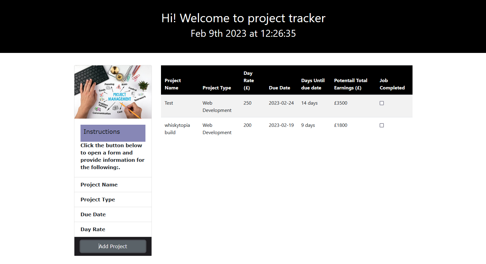

# Project Tracker

A simple front-end application to track projects.

## Features

- Add new projects by clicking on "Add Project"
- Input form for project details (project name, due date, day rate)
- Store project details in a table for easy viewing and management
- Automatically calculate the number of days until the project is due
- Calculate potential earnings based on the day rate

## Deployed site

This site is deployed using [GitHub Pages](https://pages.github.com/)
at https://kifeakor22.github.io/project-tracker/

## Usage

To use the Project Tracker, simply click on the "Add Project" button to open the input form. Fill in the details of your project and hit submit to add the project to the table. The number of days until the project is due and the potential earnings will be calculated automatically and displayed in the table.

## Technical Details

This app is built using HTML, CSS, and JavaScript (jQuery). The projects are stored in local storage and retrieved every time the app is loaded.

## Contributing

If you would like to contribute to the development of the Project Tracker, feel free to open a pull request with your changes. Your contributions are greatly appreciated!

## License

This project is licensed under the MIT License. See the [LICENSE](LICENSE) file for details.
